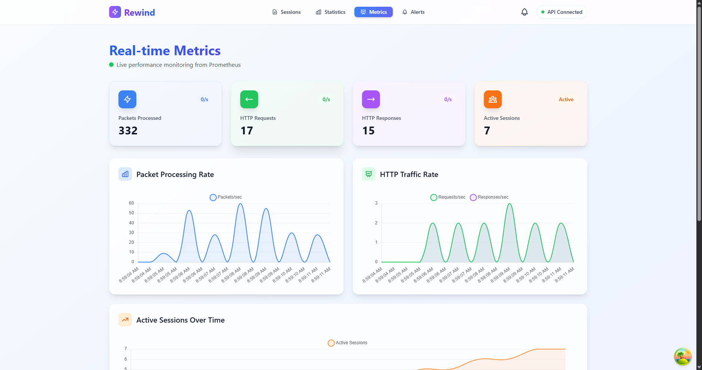
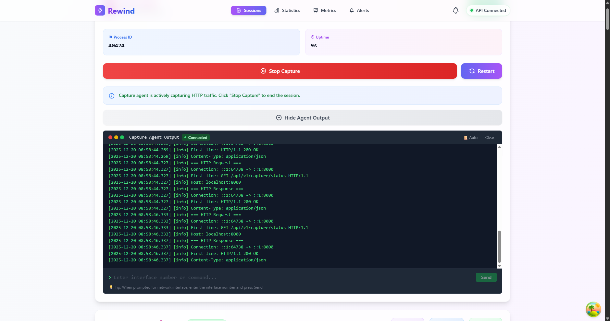
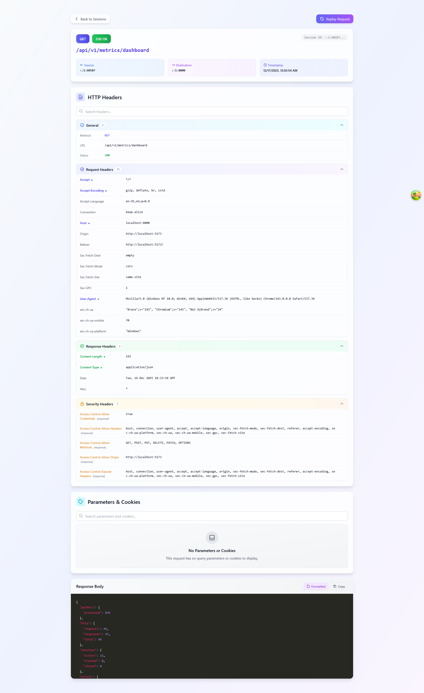

<div align="center">

# Rewind - Real-time HTTP Traffic Analyzer

[](https://bun.sh)
[](https://www.typescriptlang.org/)
[](https://kit.svelte.dev/)
[](https://elysiajs.com/)
[](https://isocpp.org/)
[](https://pcapplusplus.github.io/)
[](https://www.mongodb.com/)
[](https://prometheus.io/)
[](LICENSE)


**A high-performance, full-stack application for capturing, processing, and visualizing low-level HTTP network traffic in real-time.**


</div>

---

## Overview

Rewind is a modern debugging and monitoring tool designed to provide deep insight into network activity. It utilizes a decoupled architecture where a high-performance **C++ capture agent built on PcapPlusPlus** handles raw packet capture and HTTP reassembly, while a Bun/SvelteKit stack delivers a real-time, interactive web experience.


---

## 🛠️ Tech Stack

<p align="left">
  <a href="https://bun.sh/">
    
  </a>
  <a href="https://www.typescriptlang.org/">
    
  </a>
  <a href="https://kit.svelte.dev/">
    
  </a>
  <a href="https://elysiajs.com/">
    
  </a>
  <a href="https://www.mongodb.com/" target="_blank">
    
  </a>
  <a href="https://isocpp.org/">
    
  </a>
  <a href="https://prometheus.io/">
    
  </a>
</p>

---

## ✨ Features

### Core Capture & Analysis
- **🌐 In-Browser Capture Terminal:** Interact with the C++ capture agent to select network interfaces, view real-time logs, and monitor the capture process directly from the web UI via a two-way WebSocket stream.
- **🎮 Seamless Capture Controls:** Start, Stop, and Restart the low-level C++ process using a dedicated control panel in the browser. Features graceful shutdown using `SIGTERM` with a `SIGKILL` fallback for process cleanup.
- **📈 Real-time Traffic Metrics:** The UI polls the backend status every 2 seconds to ensure the status, uptime, and process ID are always up-to-date, and to catch process crashes immediately.
- **🛡️ Robust Data Handling:** Gracefully handles incomplete transactions, marking sessions without responses as **`Pending`** in the UI.
- **✅ Consistent Data Format:** Standardizes all field names to **`camelCase`** across C++ agent, Backend, and Frontend for data integrity.
- **🔒 PII Sanitization:** Automatically anonymizes sensitive data (email addresses, API keys) during packet capture.

### Advanced Features
- **🔄 Request Replay:** Re-send captured HTTP requests with one click. Perfect for debugging and testing API endpoints.
- **🔍 Enhanced Headers Viewer:** Beautiful, organized display of HTTP headers with syntax highlighting and categorization.
- **🍪 Smart Parser:** Automatically decode and display query parameters, cookies, and form data in a structured, readable format.
- **🔔 Alert System:** Create custom alert rules based on status codes, response times, HTTP methods, URL patterns, and more.
- **📧 Email Notifications:** Get notified via email when alerts trigger. Supports SMTP with beautiful HTML email templates.
- **📊 Session Management:** Filter, search, tag, and organize captured HTTP sessions with MongoDB-backed persistence.

---

## 📸 Screenshots

### Dashboard Overview


### In-Browser Capture Terminal


### Session Viewer


### Alert Rules


---

## 🏛️ Architecture

Rewind employs a high-performance three-tier structure to decouple low-level capture from the high-level analysis and UI.

The central component is the **Backend API**, which acts as a bridge, process manager, and real-time data broadcaster.

**Component Roles:**
* **C++ Capture Agent:** Performs raw packet capture, HTTP reassembly, PII sanitization, and writes session data to a JSON file.
* **Backend API (Bun/Elysia):** Runs the **Capture Manager** service, which handles the C++ process lifecycle and manages the two-way `ws://.../stream` WebSocket for terminal I/O and real-time data broadcasting.
* **Frontend UI (SvelteKit):** Provides the interactive dashboard, session viewer, control panel, and the built-in Capture Terminal.

---

## 📁 Project Structure & Documentation

Rewind is organized as a multi-component repository.  
Each major component has its own dedicated README with detailed setup and implementation notes.

| Component | Path | Documentation |
|--------|------|---------------|
| **Capture Agent** | `capture-agent/` | [Capture Agent README](services/capture-agent/README.md) |
| **Backend API** | `services/backend-api/` | [Backend API README](services/backend-api/README.md) |
| **Frontend UI** | `services/frontend/` | [Frontend README](services/frontend/README.md) |

> 📌 Start with the **Capture Agent**, as it is a hard dependency for both the backend and frontend.

---

## 🚀 Quick Start

### Prerequisites
- **C++ Capture Agent (Required, First)**
  - Must be built and runnable
  - Requires Administrator / `sudo` access
  - Produces JSON session files and metrics
- **Bun 1.0+** (Recommended) or Node.js 18+
- **Administrator / `sudo` access** (Required for the C++ capture agent to access network interfaces)

### Installation & Run

1.  **Clone the repository**
    ```bash
    git clone https://github.com/sreekarnv/rewind.git
    cd rewind
    ```

2.  **Install dependencies**
    ```bash
    cd capture-agent && build.bat  # Windows only, builds PcapPlusPlus-based capture agent
    cd services/backend-api && bun install
    cd services/frontend && bun install 
    ```

3.  **Start Services (Recommended: Browser Control)**
    Run the Backend API with elevated permissions to enable in-browser controls and the terminal feature:

    | Component | Command (Admin/sudo) | Port |
    | :--- | :--- | :--- |
    | **Backend API** | `cd services/backend-api && sudo bun run dev` | `8000` |
    | **Frontend UI** | `cd services/frontend && npm run dev` | `5173` |

4.  **Access UI**
    Open your browser to: **http://localhost:5173**

5.  **Start Capture**
    Click the **Start Capture** button in the UI and use the **built-in terminal** to select your network interface.

---

## Core Components

| Component | Stack | Port | Description |
|---------|------|-------------|-----------|
| **Frontend** | SvelteKit | 5173 | Real-time dashboard, Session Viewer, Capture Controls & Terminal. |
| **Backend API** | Bun + Elysia | 8000 | Capture Manager, File Watcher, WebSocket Streamer, REST API. |
| **Capture Agent** | C++ | N/A | Low-level packet capture, HTTP reassembly, PII filtering. |
| **Metrics** | Prometheus | 9090 | Metrics endpoint exposed by the C++ agent. |

---


## 📡 API Reference

The Backend API is built with Elysia and exposes comprehensive REST and WebSocket endpoints.

### Capture Control
| Endpoint | Method | Description |
| :--- | :--- | :--- |
| `/api/v1/capture/status` | `GET` | Get current capture state (running, stopped, error) |
| `/api/v1/capture/start` | `POST` | Start the C++ capture agent process |
| `/api/v1/capture/stop` | `POST` | Stop the capture agent with graceful shutdown |
| `/api/v1/capture/restart` | `POST` | Restart the capture agent |
| `/api/v1/capture/stream` | `WebSocket` | Two-way terminal I/O stream |

### Session Management
| Endpoint | Method | Description |
| :--- | :--- | :--- |
| `/api/v1/sessions` | `GET` | Get all captured sessions |
| `/api/v1/sessions/:id` | `GET` | Get session details by ID |
| `/api/v1/sessions/:id` | `DELETE` | Delete a specific session |
| `/api/v1/sessions/clear` | `DELETE` | Clear all sessions |
| `/api/v1/sessions/filter` | `POST` | Filter sessions by criteria |

### Alert Rules
| Endpoint | Method | Description |
| :--- | :--- | :--- |
| `/api/v1/alerts` | `GET` | List all alert rules |
| `/api/v1/alerts` | `POST` | Create new alert rule |
| `/api/v1/alerts/:id` | `GET` | Get alert rule details |
| `/api/v1/alerts/:id` | `PUT` | Update alert rule |
| `/api/v1/alerts/:id` | `DELETE` | Delete alert rule |
| `/api/v1/alerts/:id/toggle` | `PATCH` | Enable/disable alert rule |

### Notifications
| Endpoint | Method | Description |
| :--- | :--- | :--- |
| `/api/v1/notifications` | `GET` | List all notifications |
| `/api/v1/notifications/:id/read` | `PATCH` | Mark notification as read |
| `/api/v1/notifications/:id/dismiss` | `PATCH` | Dismiss notification |
| `/api/v1/notifications/read-all` | `PATCH` | Mark all as read |

### Real-time Updates
| Endpoint | Type | Description |
| :--- | :--- | :--- |
| `/api/v1/realtime` | `WebSocket` | Real-time session updates |
| `/api/v1/realtime/status` | `GET` | WebSocket connection status |

### Examples

```bash
# Get all sessions
curl http://localhost:8000/api/v1/sessions

# Get session details
curl http://localhost:8000/api/v1/sessions/SESSION_ID

# Create alert rule for 5xx errors
curl -X POST http://localhost:8000/api/v1/alerts \
  -H "Content-Type: application/json" \
  -d '{
    "name": "Server Errors",
    "severity": "error",
    "conditions": [{
      "type": "status_range",
      "operator": "equals",
      "value": "5xx"
    }],
    "cooldownMinutes": 5,
    "enabled": true
  }'

# Get unread notifications
curl http://localhost:8000/api/v1/notifications?status=unread
```

---

## ⚙️ Configuration

### Environment Variables

Create a `.env` file in `services/backend-api/` with the following variables:

```bash
# Server Configuration
PORT=8000

# MongoDB Configuration
MONGODB_URI=mongodb://localhost:27017/rewind

# Data Directory (where capture agent saves JSON files)
DATA_DIR=../capture-agent/output

# Email Notification Configuration (Optional)
EMAIL_ENABLED=true
EMAIL_SMTP_HOST=smtp.gmail.com
EMAIL_SMTP_PORT=587
EMAIL_SMTP_SECURE=false
EMAIL_SMTP_USER=your-email@gmail.com
EMAIL_SMTP_PASS=your-app-password
EMAIL_FROM=Rewind Alerts <noreply@rewind.local>
EMAIL_RECIPIENT=admin@example.com
EMAIL_RETRY_ATTEMPTS=3
EMAIL_RETRY_DELAY=2000
FRONTEND_URL=http://localhost:5173
```

### MongoDB Setup

1. **Install MongoDB** (if not already installed):
   ```bash
   # macOS
   brew install mongodb-community

   # Ubuntu/Debian
   sudo apt-get install mongodb

   # Windows
   # Download from: https://www.mongodb.com/try/download/community
   ```

2. **Start MongoDB**:
   ```bash
   # macOS/Linux
   mongod --dbpath /path/to/data

   # Windows
   mongod --dbpath C:\data\db
   ```

3. **Verify Connection**:
   ```bash
   mongosh mongodb://localhost:27017/rewind
   ```

### Email Notifications Setup

For detailed email configuration instructions, see [EMAIL_SETUP_GUIDE.md](docs/EMAIL_SETUP_GUIDE.md).

**Quick Start with Gmail:**
1. Enable 2-Factor Authentication on your Gmail account
2. Generate an App Password at https://myaccount.google.com/apppasswords
3. Update `.env` with your credentials:
   ```bash
   EMAIL_SMTP_USER=your-email@gmail.com
   EMAIL_SMTP_PASS=generated-app-password
   EMAIL_RECIPIENT=recipient@example.com
   ```

---

## 📚 Documentation

Full documentation is available in the `docs/` directory and can be viewed as a website:

**View Documentation:**
- 🌐 **[Documentation Website](https://sreekarnv.github.io/rewind/)** (GitHub Pages)
- 📖 **[Browse on GitHub](docs/)** (Markdown files)

**Documentation Sections:**
- **[User Guide](docs/USER_GUIDE.md)** - Complete guide for using Rewind
- **[Developer Guide](docs/DEVELOPER_GUIDE.md)** - Development setup and architecture
- **[Email Setup Guide](docs/EMAIL_SETUP_GUIDE.md)** - Detailed email configuration
- **[Alert System](docs/EMAIL_ALERT_SYSTEM_COMPLETE.md)** - Alert system documentation

**Run Documentation Locally:**
```bash
cd docs
bun install
bun run dev
# Visit http://localhost:5173
```

---

## 🎯 Use Cases

- **API Debugging:** Capture and analyze HTTP requests/responses in real-time
- **Performance Monitoring:** Track response times, identify slow endpoints
- **Security Analysis:** Monitor for suspicious patterns, unauthorized access
- **Integration Testing:** Verify API behavior, inspect headers and payloads
- **Error Tracking:** Get alerted when errors occur, debug with full context
- **Traffic Analysis:** Understand application behavior, identify bottlenecks

---

## 🤝 Contributing

Contributions are welcome! Please read our [Contributing Guide](CONTRIBUTING.md) for details on our development process and how to submit pull requests.

**Quick Start:**

1. Fork the repository
2. Create your feature branch (`git checkout -b feature/AmazingFeature`)
3. Commit your changes (`git commit -m 'Add some AmazingFeature'`)
4. Push to the branch (`git push origin feature/AmazingFeature`)
5. Open a Pull Request

See the [Developer Guide](docs/DEVELOPER_GUIDE.md) for complete development setup instructions.

---

## 📄 License

This project is licensed under the MIT License - see the [LICENSE](LICENSE) file for details.

---

## 🙏 Acknowledgments

- **PcapPlusPlus** - High-performance packet capture library
- **Bun** - Fast all-in-one JavaScript runtime
- **SvelteKit** - Modern web framework
- **ElysiaJS** - Fast and friendly Bun web framework
- **MongoDB** - Document database for session storage
- **TailwindCSS** - Utility-first CSS framework

---

<div align="center">

**Built with ❤️ by the Rewind Team**

[Report Bug](https://github.com/sreekarnv/rewind/issues) · [Request Feature](https://github.com/sreekarnv/rewind/issues)

</div
